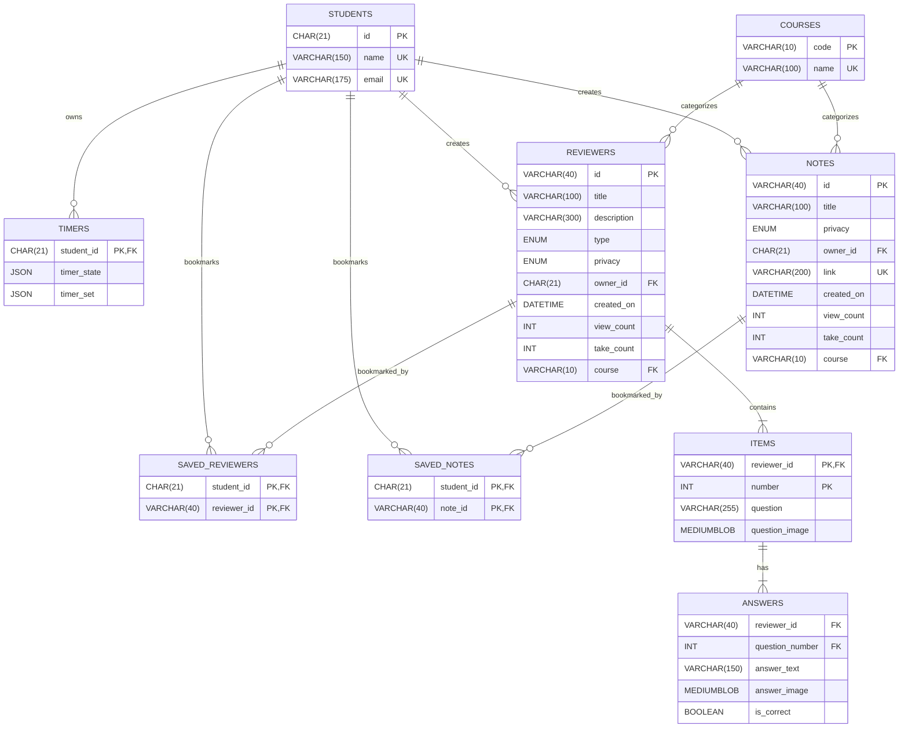
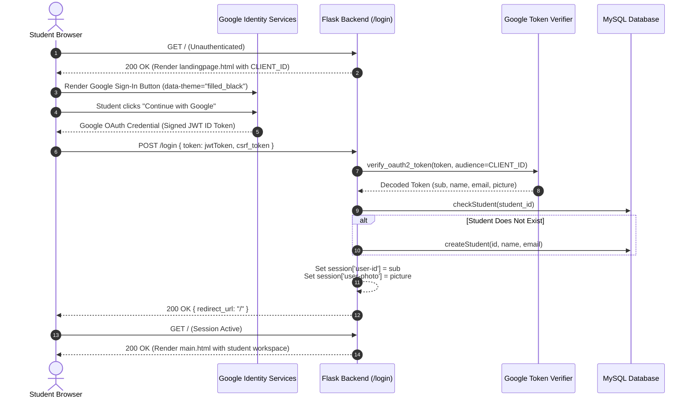

# IIT Buddy

<p align="center">
  
</p>

<p align="center">
  <strong>A collaborative study platform and productivity ecosystem designed for MSU-IIT Computer Science students.</strong>
</p>

<p align="center">
  
  
  
  
  
</p>

## 🛠️ Technologies

| Category | Stack |
|---|---|
| **Backend** | Python 3.10+, Flask 3.0.3, Flask-MySQLdb 2.0, mysqlclient 2.2, Flask-WTF CSRF, Google OAuth 2.0, JWT Verification |
| **Database** | MySQL 8.0+ / MariaDB 10.4+, SQL, Foreign Keys, SHA1/MD5 Triggers |
| **Frontend** | Jinja2 Templates, Bootstrap 5.3, Vanilla CSS, Vanilla JavaScript, SweetAlert2, Font Awesome, Boxicons |
| **Tools** | Pipenv, python-dotenv, Werkzeug, Git |
| **Architecture** | Flask Blueprints, Monolithic Application, Middleware Decorators, MVC-inspired Pattern |
| **Features** | JSON State Persistence, Role-Based Access Control, Privacy Controls (Private/Public/Shared), Anti-Self-Take Rule |

---

> **Target Version**: Original Repository State at Commit `807441a` (*"Enabled No Take if Owner"*)  
> **Course**: CSC181 - Software Engineering  
> **Institution**: Mindanao State University – Iligan Institute of Technology (MSU-IIT)  
> **Authors & Creators**: [Caine Ivan Bautista](https://github.com/), [Louise Antondy Garbanzos](https://github.com/), [Shir Keilah Connor](https://github.com/), [Earl Andrew Ruelo](https://github.com/)  

---

## Table of Contents

- [Overview](#overview)
- [Key Features](#key-features)
- [System Architecture](#system-architecture)
- [Database Schema & ER Diagram](#database-schema--er-diagram)
- [Authentication Workflow](#authentication-workflow)
- [Modules & Blueprint Directory](#modules--blueprint-directory)
- [Study Engines Breakdown](#study-engines-breakdown)
- [Repository Structure](#repository-structure)
- [Setup & Installation](#setup--installation)
- [Verification & Testing](#verification--testing)
- [Academic Credits](#academic-credits)

---

## Overview

**IIT Buddy** is a centralized web platform engineered to address the fragmented nature of academic study resources among university students. Developed as the culminating project for **CSC181 (Software Engineering)** at **MSU-IIT**, it provides computer science undergraduates with a collaborative environment to create, discover, and solve academic assessments while managing study sessions through a real-time, state-persistent study timer.

### Core Objectives
* **Interactive Assessment Generation**: Create and solve study sets across 4 evaluation formats (**Flashcards**, **Identification**, **Multiple Choice**, and **Mixed Mode**).
* **Curated Notes & Resources**: Organize external academic documentation (e.g., Google Drive links) tagged by official MSU-IIT course codes.
* **Peer-to-Peer Academic Exchange**: Explore public resources via a paginated, filterable community feed with bookmarking capabilities.
* **Embedded Study Timer**: Maintain focus with an integrated floating timer supporting custom presets and persistent MySQL state synchronization.
* **Institutional Authentication**: Secure login restricted to institutional Google Workspace accounts via Google Identity Services (GIS).

---

## Key Features

| Feature | Description |
| :--- | :--- |
| 🗂️ **Interactive Reviewers** | Four assessment modes: 3D flip Flashcards, text-match Identification, 4-option Multiple Choice, and dynamic Mixed tests. |
| 📝 **Curated Notes** | Bookmark, categorize, and link external study docs with customizable visibility (**Public**, **Private**, **Shared**). |
| 🌐 **Reviewers Feed** | Public community discovery feed with search, course filtering, bookmarking, and pagination. |
| 🔖 **Saved Library** | Dedicated repository aggregating all personal bookmarked notes and reviewers. |
| ⏱️ **Persistent Study Timer** | Global navbar stopwatch and countdown timer with state persistence across pages and reloads. |
| 🔒 **Google OAuth 2.0** | Single Sign-On utilizing Google Identity Services (GIS) with server-side JWT verification. |
| 🛡️ **Anti-Self-Take Rule** | Integrity mechanism preventing reviewers' authors from inflating take counts on their own tests. |

---

## System Architecture

The application implements a modular monolithic architecture structured using **Flask Blueprints** and an **MVC-inspired design pattern**:

```
                              ┌─────────────────────────────────────────┐
                              │           Client Web Browser            │
                              │  (HTML5 / Vanilla CSS / JS / Bootstrap) │
                              └────────────────────┬────────────────────┘
                                                   │
                            HTTP / REST / OAuth2   │   Web Assets & Jinja2
                                                   ▼
┌────────────────────────────────────────────────────────────────────────────────────────┐
│                                   Flask Application                                    │
│                                                                                        │
│  ┌────────────────────┐   ┌─────────────────────────────────────────────────────────┐  │
│  │   Authentication   │   │                    Domain Blueprints                    │  │
│  │   & Middleware     │   │                                                         │  │
│  │ ────────────────── │   │ ┌────────────────┐ ┌──────────────────────────────────┐ │  │
│  │ • Google OAuth2    │   │ │  modules.notes │ │         modules.reviewers        │ │  │
│  │ • CSRF Protection  │   │ │  (/notes)      │ │         (/reviewers)             │ │  │
│  │ • @require_login   │   │ └────────────────┘ │ ├── /flashcards                  │ │  │
│  │ • Session Manager  │   │                    │ ├── /identifications             │ │  │
│  └────────────────────┘   │ ┌────────────────┐ │ ├── /multiple_choice             │ │  │
│                           │ │  reviewersFeed │ │ ├── /mixed                       │ │  │
│                           │ │  (/reviewers-  │ │ └── /reviewers-list              │ │  │
│                           │ │   feed)        │ └──────────────────────────────────┘ │  │
│                           │ └────────────────┘ ┌──────────────────────────────────┐ │  │
│                           │                    │        modules.savedPage         │ │  │
│                           │                    │        (/saved-page)             │ │  │
│                           │                    └──────────────────────────────────┘ │  │
│                           └─────────────────────────────────────────────────────────┘  │
└───────────────────────────────────────────┬────────────────────────────────────────────┘
                                            │
                                  mysqlclient / SQL Queries
                                            ▼
┌────────────────────────────────────────────────────────────────────────────────────────┐
│                              Relational Database (MySQL)                               │
│                                                                                        │
│  • students        • timers          • courses         • notes (SHA1 triggers)         │
│  • reviewers       • items           • answers         • saved_notes & saved_reviewers │
└────────────────────────────────────────────────────────────────────────────────────────┘
```

### Technology Breakdown

* **Backend Engine**: Python 3, Flask 3.0.3, Flask-MySQLdb 2.0.0, mysqlclient 2.2.4
* **Security & Auth**: Flask-WTF 1.2.1 (CSRF protection), google-auth 2.36.0, Authlib 1.3.2
* **Frontend UI**: Jinja2 3.1.4, Vanilla CSS, Bootstrap 5.3.3, Boxicons 2.1.4, Font Awesome 6.6.0, SweetAlert2
* **Database**: MySQL 8.0+ / MariaDB 10.4+ with automated SHA1 hash triggers and cascading constraints

---

## Database Schema & ER Diagram

The database schema (`iit_buddy_db`) enforces referential integrity through foreign keys with cascading deletions, unique constraints, and automated SHA1 hash generation triggers.



<details>
<summary><strong>Click to view Table Specifications & Triggers</strong></summary>

### Table Descriptions

1. **`students`**: User profile information stored from the Google OAuth 2.0 ID token (`id` CHAR(21) PK, `name`, `email`).
2. **`timers`**: Study timer state (`timer_state` JSON) and preset configuration (`timer_set` JSON) per student.
3. **`courses`**: Lookup table pre-loaded with 8 MSU-IIT CS curriculum courses (`CSC181`, `CCC181`, `CSC145`, `CSC155`, `CSC171`, `CCC151`, `CSC112`, `CSC124`).
4. **`notes`**: Shared and private note records with external documentation URLs and course tags.
5. **`reviewers`**: Parent metadata record for assessment sets (`Flashcard`, `Identification`, `Multiple Choice`, `Mixed`).
6. **`items`**: Questions and flashcard terms linked to reviewers.
7. **`answers`**: Candidate answers with `is_correct` boolean flags (1 for correct, 0 for distractors).
8. **`saved_reviewers` & `saved_notes`**: Junction tables maintaining personal student bookmarks.

### Automated Triggers

```sql
DELIMITER //
CREATE TRIGGER `generate_note_id`
BEFORE INSERT ON `notes`
FOR EACH ROW
BEGIN
	DECLARE random_suffix CHAR(4);
	SET random_suffix = SUBSTRING(MD5(RAND()), 1, 4);
	SET NEW.id = SHA1(CONCAT(NEW.`created_on`, NEW.`owner_id`, random_suffix));
END //
DELIMITER ;

DELIMITER //
CREATE TRIGGER `generate_reviewer_id`
BEFORE INSERT ON `reviewers`
FOR EACH ROW
BEGIN
	DECLARE random_suffix CHAR(4);
	SET random_suffix = SUBSTRING(MD5(RAND()), 1, 4);
	SET NEW.id = SHA1(CONCAT(NEW.`created_on`, NEW.`owner_id`, NEW.`type`, random_suffix));
END //
DELIMITER ;
```
</details>

---

## Authentication Workflow

The application implements Google OAuth 2.0 via Google Identity Services (GIS):



1. **Client Prompt**: `landingpage.html` loads GIS SDK (`accounts.google.com/gsi/client`) and renders the button with server-injected `CLIENT_ID`.
2. **Token Dispatch**: JavaScript callback `handleCredentialResponse(response)` sends the signed JWT to `/login` via POST.
3. **Server Verification**: `decode_google_jwt()` verifies the signature, expiration, and audience using Google's public certs.
4. **Session Persistence**: Sets `session['user-id']` and `session['user-photo']` with a 24-hour lifetime.
5. **Route Protection**: The `@require_login` decorator guards protected endpoints, preserving destination URLs in `session['next_url']`.

---

## Modules & Blueprint Directory

| Blueprint | Route Prefix | Key Responsibilities |
| :--- | :--- | :--- |
| **Core / Auth** | `/` | Landing page, `/login`, `/logout`, `/timer`, `/set-timer`, main dashboard. |
| **Notes** | `/notes` | `/add_note`, `/update_note`, `/delete_note/<id>`, `/notes_list`. |
| **Reviewers** | `/reviewers` | Reviewer creation, metadata update, deletion, counter increments. |
| ├── **Flashcards** | `/reviewers/flashcards` | Card editor, interactive 3D review mode (`/review/<id>/r=<bool>`), take mode. |
| ├── **Identification** | `/reviewers/identifications` | Text matching question-and-answer verification engine. |
| ├── **Multiple Choice** | `/reviewers/multiple_choice` | 4-option engine with automated distractor shuffling (`random.sample`). |
| ├── **Mixed Mode** | `/reviewers/mixed` | Hybrid engine evaluating single answers as Identification and multi-answers as Choice. |
| └── **Reviewers List** | `/reviewers/reviewers-list` | Personal catalog with search, course filters, privacy filters, and pagination. |
| **Reviewers Feed** | `/reviewers-feed` | Community discovery feed, multi-parameter filtering, bookmarking (`save_reviewer`). |
| **Saved Page** | `/saved-page` | Personal library of bookmarked community reviewers and external notes. |

---

## Study Engines Breakdown

```
                          ┌───────────────────────────┐
                          │   Reviewer Types Engine   │
                          └─────────────┬─────────────┘
                                        │
         ┌──────────────────┬───────────┴───────────┬──────────────────┐
         ▼                  ▼                       ▼                  ▼
  ┌──────────────┐   ┌──────────────┐        ┌──────────────┐   ┌──────────────┐
  │  Flashcards  │   │Identification│        │MultipleChoice│   │  Mixed Mode  │
  └──────┬───────┘   └──────┬───────┘        └──────┬───────┘   └──────┬───────┘
         │                  │                       │                  │
         │ Flip Animation   │ Text Input Matching   │ 1 Correct +      │ Dynamic Type:
         │ Shuffle (r=true) │ Case-insensitive      │ 3 Distractors    │ Single ans = Ident
         │ Term-Definition  │ Validation            │ Random options   │ Multi ans = Choice
```

### 1. Flashcards Engine (`/reviewers/flashcards`)
* **Review Mode**: Interactive CSS 3D transform card flip displaying terms and definitions.
* **Randomization**: Supports parameter `r=true` or `r=false` for randomized deck order.
* **Completion**: Displays celebratory modal upon finishing the card deck.

### 2. Identification Engine (`/reviewers/identifications`)
* **Prompt & Response**: Direct question prompts with client-side text input.
* **Validation**: Trims whitespace and validates strings against recorded answers with immediate feedback.

### 3. Multiple Choice Engine (`/reviewers/multiple_choice`)
* **Balanced Options**: Requires 1 correct answer and 3 distractors per item.
* **Position Randomization**: Dynamically shuffles options using `random.sample()` on each execution to eliminate position bias.

### 4. Mixed Assessment Engine (`/reviewers/mixed`)
* **Dynamic Evaluation**: Blends both Identification and Multiple Choice items within a single test.
* **Automated Recognition**:
  ```python
  question_data = {
      'number': question[0],
      'type': "Multiple Choice" if len(answers) > 1 else "Identification",
      'question': question[1],
      'answer': answers
  }
  ```

### 5. Take Engine & "No Take if Owner" Restriction
* Non-authors take public reviewers via `/reviewers/<type>/take/<id>`.
* **Owner Restriction (Commit `807441a`)**: In `modules/reviewersFeed/routes.py`, creators are restricted from entering "Take" mode on their own reviewers, preventing artificial inflation of take statistics.

---

## Repository Structure

```
CSC181-IIT-Buddy/
├── app.py                             # WSGI application entrypoint
├── config.py                          # Environment variable configuration loader
├── requirements.txt                   # Project package dependencies
├── Pipfile & Pipfile.lock             # Pipenv dependency management files
├── README.md                          # Repository documentation
├── iit_buddy_db.sql                   # Relational database schema & triggers
├── .env-sample                        # Environment variables template
│
└── modules/                           # Root application package
    ├── __init__.py                    # Flask application factory (start_app)
    ├── routes.py                      # Global routes (/, /login, /logout, /timer)
    ├── controller.py                  # Core database operations and OAuth handlers
    ├── notes/                         # Notes Management Blueprint
    ├── reviewers/                     # Reviewers Master Blueprint
    │   ├── flashcards/                # Flashcards sub-blueprint
    │   ├── identifications/           # Identifications sub-blueprint
    │   ├── multipleChoice/            # Multiple Choice sub-blueprint
    │   ├── mixed/                     # Mixed assessment sub-blueprint
    │   └── reviewersList/             # Personal reviewers catalog sub-blueprint
    ├── reviewersFeed/                 # Community Feed Blueprint
    ├── savedPage/                     # Bookmarks Hub Blueprint
    ├── static/                        # CSS styles, JS scripts, and images
    └── templates/                     # Jinja2 HTML layout and feature templates
```

---

## Setup & Installation

### Prerequisites
* **Python**: `3.10` – `3.14`
* **Database**: MySQL Server `8.0+` or MariaDB `10.4+` (e.g., via XAMPP/LAMPP)
* **Google Cloud Console**: OAuth 2.0 Web Client ID

---

### Step-by-Step Instructions

#### 1. Clone & Prepare Virtual Environment
```bash
git clone <repository_url> CSC181-IIT-Buddy
cd CSC181-IIT-Buddy

python -m venv .venv
source .venv/bin/activate
```

#### 2. Install Dependencies
```bash
pip install -r requirements.txt
```
> [!NOTE]
> On Arch/CachyOS systems with MariaDB/LAMPP installed at `/opt/lampp`, ensure client libraries are in your `PKG_CONFIG_PATH`:
> ```bash
> export PKG_CONFIG_PATH="/opt/lampp/lib/pkgconfig:$PKG_CONFIG_PATH"
> ```

#### 3. Database Initialization
Ensure your MySQL/MariaDB server is running, then import the database schema:
```bash
mysql -u root -p < iit_buddy_db.sql
```

#### 4. Configure Environment Variables
Create your `.env` file from the sample:
```bash
cp .env-sample .env
```
Populate `.env` with your local settings:
```ini
DB_HOST=localhost
DB_PORT=3306
DB_NAME=iit_buddy_db
DB_USERNAME=root
DB_PASSWORD=your_mysql_password
SECRET_KEY=your_generated_secret_key
BOOTSTRAP_SERVE_LOCAL=True
CLIENT_ID=your_google_client_id.apps.googleusercontent.com
CLIENT_SECRET=your_google_client_secret
FLASK_DEBUG=1
FLASK_APP=app.py
```

#### 5. Google Cloud OAuth 2.0 Configuration
1. Open the [Google Cloud Console](https://console.cloud.google.com/).
2. Create an **OAuth 2.0 Client ID** (Web application).
3. Set **Authorized JavaScript origins**:
   - `http://localhost:5000`
   - `http://127.0.0.1:5000`
4. Set **Authorized redirect URIs**:
   - `http://localhost:5000/login`
   - `http://127.0.0.1:5000/login`
5. Copy your Client ID and Client Secret into `.env`.

#### 6. Run the Application
```bash
python app.py
```
Open your browser and navigate to `http://localhost:5000/`.

---

## Verification & Testing

| Flow | Test Action | Expected Result |
| :--- | :--- | :--- |
| **Authentication** | Access `/` while unauthenticated | Renders `landingpage.html` with Google Sign-In prompt. |
| | Unauthenticated access to `/notes` | Redirects to `/` and records `session['next_url']`. |
| | Sign in with Google | Decodes token, creates student in DB, sets session, opens dashboard. |
| | Click Logout | Resets user timer in DB, invalidates session, redirects to landing page. |
| **Study Timer** | Click clock icon in navbar | Opens floating timer widget. |
| | Set duration (e.g., 25m) & Start | Timer runs and periodically syncs countdown state to MySQL `timers` table. |
| | Navigate between pages | Timer continues running without resetting or losing elapsed time. |
| **Notes** | Add Note | Inserts record, generates SHA1 ID via trigger, displays in carousel. |
| | Click Note card | Opens external document in new browser tab (`target="_blank"`). |
| **Reviewers** | Create Assessment | Formulates reviewer set and opens author review/edit interface. |
| | Take Public Reviewer | Interactive evaluation mode functions smoothly with live feedback. |
| | Owner Take Check | Prevents creator from taking their own reviewer (`No Take if Owner`). |
| **Feed** | Filter by Course / Type | Accurately narrows displayed reviewers and notes. |
| | Save / Bookmark | Inserts into `saved_reviewers` and updates bookmark button state. |

---

## Academic Credits

Developed for **CSC181 (Software Engineering)** under the Department of Computer Science at **Mindanao State University – Iligan Institute of Technology**.

### Development Team
* **Caine Ivan Bautista** – Computer Science Student, MSU-IIT
* **Louise Antondy Garbanzos** – Computer Science Student, MSU-IIT
* **Shir Keilah Connor** – Computer Science Student, MSU-IIT
* **Earl Andrew Ruelo** – Computer Science Student, MSU-IIT

---

<p align="center">
  <sub>ⓒ 2024 IIT Buddy · MSU-IIT Computer Science</sub>
</p>